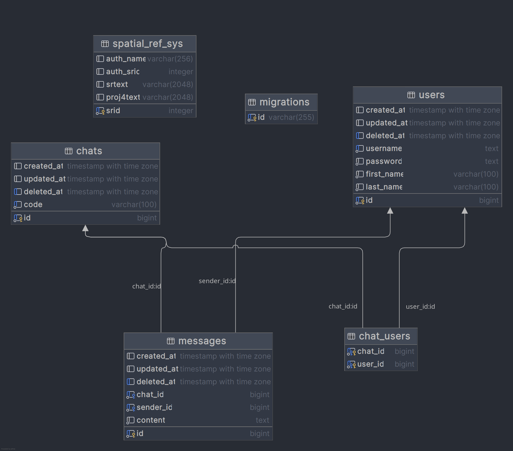

<pre>   __ _       _    _           ___ _           _   
  / /(_)_ __ | | _(_)_ __     / __\ |__   __ _| |_ 
 / / | | '_ \| |/ / | '_ \   / /  | '_ \ / _` | __|
/ /__| | | | |   <| | | | | / /___| | | | (_| | |_ 
\____/_|_| |_|_|\_\_|_| |_| \____/|_| |_|\__,_|\__|
</pre>

Linkin Chat is a TUI (Text User Interface) based chat application that uses HTTP and NATS for communication and broadcasting messages between the client and server.

## Table Of Content
<!-- TOC -->
  * [Table Of Content](#table-of-content)
  * [Tech Stack](#tech-stack)
  * [Why TUI?](#why-tui)
  * [Features](#features)
  * [Known Issues](#known-issues)
  * [Planned Improvements](#planned-improvements)
  * [UML](#uml)
<!-- TOC -->

## Tech Stack
- Server
  - [Fiber (http)](https://gofiber.io)
  - [Nats](https://nats.io)
- Database
  - Postgres
- Tools
  - Docker
  - Makefile
- Cache
  - Redis
- Config
  - [Viper](https://github.com/spf13/viper)
- Client
  - UI: [tview](https://github.com/rivo/tview)
  - Release: [Goreleaser](https://goreleaser.com/) 
  - CLI: [Cobra](https://github.com/spf13/cobra)

## Why TUI?
The decision to use a Text User Interface (TUI) was driven by:
- Simplicity: TUIs are lightweight and focus on functionality over aesthetics, perfect for command-line environments.
- Accessibility: Users who prefer or are limited to CLI environments can easily interact with the application.
- Efficiency: TUIs provide quick navigation and functionality using keyboard shortcuts, which is great for power users.
- Customizability: A TUI can be easily adapted for various workflows and allows developers to focus on core features.

## Features
Linkin Chat provides the following core functionalities:
1. **Create User:** Register a new user.
2. **Login User:** Log in to the application with your credentials.
3. **Create Chatroom:** Start a new chatroom for communication.
4. **Delete Chatroom:** Remove an existing chatroom that you own.
5. **Join Chatroom:** Join a chatroom to start chatting with others.
6. **Delete Your Chatroom:** Remove the chatrooms you created.

Users can navigate through the interface using:
- **Tab** and **Shift+Tab** to move between objects.
- **Arrow Keys** (Up/Down) to select items in a list.

## Known Issues
- **Nats Authentication & Authorization**
- **Hardcoded Variables:** Some variables in the code are hardcoded, which may cause inflexibility and potential errors.
- **Limited Development Time:** Due to illness (Gastrointestinal coronavirus), development time was severely restricted to just three full working days. I was sick from Saturday, January 18th to Tuesday, January 21st. As a result, many planned features and improvements could not be implemented, including:
  - Fully functional chatroom features.
  - Logging systems for containers, servers, and clients.
  - Integration of the zap logging library.
  - Ban user feature.
  - Cache queries.

This aspect required extensive effort to balance security, performance, and functionality within the limited timeframe.

## Planned Improvements
Once the foundational features are stable, the following improvements and features are planned:
- Add a fully functional chatroom experience with message persistence.
- Implement logging systems for better observability.
- Add security enhancements for user authentication and NATS connections.
- Introduce the "ban user" feature for moderators to manage chatrooms.
- Refactor code to remove hardcoded variables and improve configurability.

## UML
